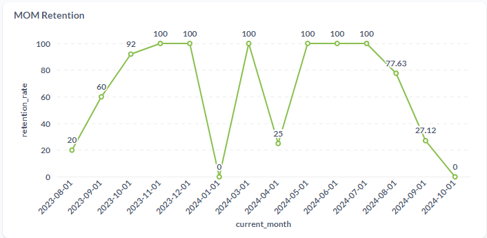
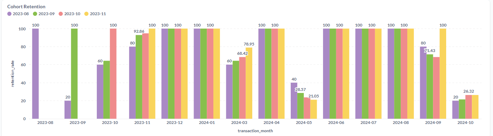
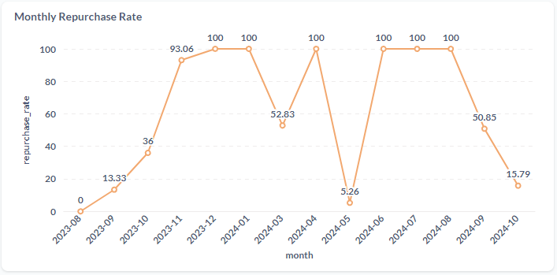
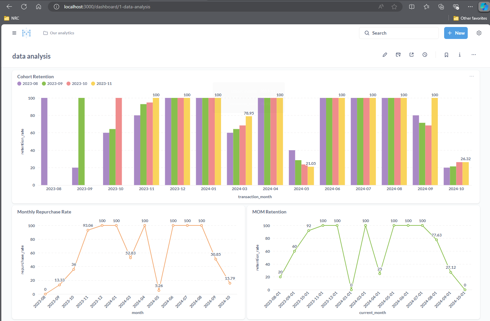

# Digitoon Final

### 1. Calculate Month-over-Month (MoM) Retention

**Definition:**
Month-over-Month (MoM) retention measures the percentage of customers who made a purchase in a given month and returned to make another purchase in the following month.
##

##
**SQL Code:**
```sql
-- MoM Retention
WITH monthly_customers AS (
    SELECT 
        customer_id,
        DATE_FORMAT(transaction_date, '%Y-%m-01') AS month
    FROM transactions
    GROUP BY customer_id, month
),
retention AS (
    SELECT 
        a.month AS current_month,
        COUNT(DISTINCT a.customer_id) AS current_month_customers,
        COUNT(DISTINCT b.customer_id) AS retained_customers
    FROM monthly_customers a
    LEFT JOIN monthly_customers b
    ON a.customer_id = b.customer_id
    AND DATE_ADD(a.month, INTERVAL 1 MONTH) = b.month
    GROUP BY a.month
)
SELECT 
    current_month,
    CASE 
        WHEN current_month_customers = 0 THEN 0
        ELSE (retained_customers / current_month_customers) * 100 
    END AS retention_rate
FROM retention
ORDER BY current_month;
```

### Part 1: `monthly_customers`
```sql
WITH monthly_customers AS (
    SELECT 
        customer_id,
        DATE_FORMAT(transaction_date, '%Y-%m-01') AS month
    FROM transactions
    GROUP BY customer_id, month
)
```
- **Purpose**: This part creates a temporary table (`monthly_customers`) that identifies each customer and the month of their transactions.
- **Key Components**:
  - **`customer_id`**: Identifies each customer.
  - **`DATE_FORMAT(transaction_date, '%Y-%m-01') AS month`**: Formats the transaction date to the first day of the month ('YYYY-MM-01') to group transactions by month.
  - **`GROUP BY customer_id, month`**: Groups the results by customer and month.

### Part 2: `retention`
```sql
retention AS (
    SELECT 
        a.month AS current_month,
        COUNT(DISTINCT a.customer_id) AS current_month_customers,
        COUNT(DISTINCT b.customer_id) AS retained_customers
    FROM monthly_customers a
    LEFT JOIN monthly_customers b
    ON a.customer_id = b.customer_id
    AND DATE_ADD(a.month, INTERVAL 1 MONTH) = b.month
    GROUP BY a.month
)
```
- **Purpose**: This part creates another temporary table (`retention`) that calculates the number of customers in each month and the number of customers retained from the previous month.
- **Key Components**:
  - **`a.month AS current_month`**: Selects the current month from the `monthly_customers`.
  - **`COUNT(DISTINCT a.customer_id) AS current_month_customers`**: Counts the number of unique customers in the current month.
  - **`COUNT(DISTINCT b.customer_id) AS retained_customers`**: Counts the number of unique customers who made purchases in both the current month and the previous month.
  - **`LEFT JOIN monthly_customers b ON a.customer_id = b.customer_id AND DATE_ADD(a.month, INTERVAL 1 MONTH) = b.month`**: Performs a left join on the `monthly_customers` to find customers who made purchases in both the current month and the previous month.
  - **`GROUP BY a.month`**: Groups the results by the current month.

### Part 3: Final SELECT Statement
```sql
SELECT 
    current_month,
    CASE 
        WHEN current_month_customers = 0 THEN 0
        ELSE (retained_customers / current_month_customers) * 100 
    END AS retention_rate
FROM retention
ORDER BY current_month;
```
- **Purpose**: This part selects the final results from the `retention` and calculates the retention rate for each month.
- **Key Components**:
  - **`current_month`**: Selects the current month.
  - **`CASE WHEN current_month_customers = 0 THEN 0 ELSE (retained_customers / current_month_customers) * 100 END AS retention_rate`**: Calculates the retention rate. If there are no customers in the current month, the retention rate is set to 0. Otherwise, it calculates the retention rate as the percentage of customers retained from the previous month.
  - **`ORDER BY current_month`**: Orders the results by the current month.
##
### 2. Calculate Retention Cohorts (Temporal Cohort)

**Definition:**
Retention cohorts group customers based on their first purchase date and track their retention over time.
##
### Metabase doesn't support the cohort chart.

##
**SQL Code:**
```sql
-- Retention Cohorts
WITH first_purchase AS (
    SELECT 
        customer_id,
        MIN(transaction_date) AS first_purchase_date
    FROM transactions
    GROUP BY customer_id
),
cohorts AS (
    SELECT 
        a.customer_id,
        DATE_FORMAT(a.first_purchase_date, '%Y-%m') AS cohort_month,
        DATE_FORMAT(b.transaction_date, '%Y-%m') AS transaction_month
    FROM first_purchase a
    INNER JOIN transactions b
    ON a.customer_id = b.customer_id
),
cohort_sizes AS (
    SELECT 
        cohort_month,
        COUNT(DISTINCT customer_id) AS cohort_size
    FROM cohorts
    GROUP BY cohort_month
)
SELECT 
    c.cohort_month,
    c.transaction_month,
    COUNT(DISTINCT c.customer_id) AS customers,
    (COUNT(DISTINCT c.customer_id) / cs.cohort_size) * 100 AS retention_rate
FROM cohorts c
INNER JOIN cohort_sizes cs
ON c.cohort_month = cs.cohort_month
GROUP BY c.cohort_month, c.transaction_month, cs.cohort_size
ORDER BY c.cohort_month, c.transaction_month;
```

### Part 1: `first_purchase`
```sql
WITH first_purchase AS (
    SELECT 
        customer_id,
        MIN(transaction_date) AS first_purchase_date
    FROM transactions
    GROUP BY customer_id
)
```
- **Purpose**: This part creates a temporary table (`first_purchase`) that identifies the first purchase date for each customer.
- **Key Components**:
  - **`customer_id`**: Identifies each customer.
  - **`MIN(transaction_date) AS first_purchase_date`**: Finds the earliest transaction date for each customer.
  - **`GROUP BY customer_id`**: Groups the results by customer.

### Part 2: `cohorts`
```sql
cohorts AS (
    SELECT 
        a.customer_id,
        DATE_FORMAT(a.first_purchase_date, '%Y-%m') AS cohort_month,
        DATE_FORMAT(b.transaction_date, '%Y-%m') AS transaction_month
    FROM first_purchase a
    INNER JOIN transactions b
    ON a.customer_id = b.customer_id
)
```
- **Purpose**: This part creates another temporary table (`cohorts`) that assigns each customer to a cohort based on their first purchase month and tracks their transactions over time.
- **Key Components**:
  - **`a.customer_id`**: Selects the customer ID from the `first_purchase`.
  - **`DATE_FORMAT(a.first_purchase_date, '%Y-%m') AS cohort_month`**: Formats the first purchase date to 'YYYY-MM' to group customers into cohorts by their first purchase month.
  - **`DATE_FORMAT(b.transaction_date, '%Y-%m') AS transaction_month`**: Formats the transaction date to 'YYYY-MM' to track transactions by month.
  - **`INNER JOIN transactions b ON a.customer_id = b.customer_id`**: Joins the `first_purchase` with the `transactions` table to get all transactions for each customer.

### Part 3: `cohort_sizes`
```sql
cohort_sizes AS (
    SELECT 
        cohort_month,
        COUNT(DISTINCT customer_id) AS cohort_size
    FROM cohorts
    GROUP BY cohort_month
)
```
- **Purpose**: This part creates another temporary table (`cohort_sizes`) that calculates the size of each cohort.
- **Key Components**:
  - **`cohort_month`**: Selects the cohort month.
  - **`COUNT(DISTINCT customer_id) AS cohort_size`**: Counts the number of unique customers in each cohort.
  - **`GROUP BY cohort_month`**: Groups the results by cohort month.

### Part 4: Final SELECT Statement
```sql
SELECT 
    c.cohort_month,
    c.transaction_month,
    COUNT(DISTINCT c.customer_id) AS customers,
    (COUNT(DISTINCT c.customer_id) / cs.cohort_size) * 100 AS retention_rate
FROM cohorts c
INNER JOIN cohort_sizes cs
ON c.cohort_month = cs.cohort_month
GROUP BY c.cohort_month, c.transaction_month, cs.cohort_size
ORDER BY c.cohort_month, c.transaction_month;
```
- **Purpose**: This part selects the final results from the `cohorts` and `cohort_sizes` and calculates the retention rate for each cohort over time.
- **Key Components**:
  - **`c.cohort_month`**: Selects the cohort month.
  - **`c.transaction_month`**: Selects the transaction month.
  - **`COUNT(DISTINCT c.customer_id) AS customers`**: Counts the number of unique customers in each cohort for each transaction month.
  - **`(COUNT(DISTINCT c.customer_id) / cs.cohort_size) * 100 AS retention_rate`**: Calculates the retention rate as the percentage of customers retained from the cohort.
  - **`INNER JOIN cohort_sizes cs ON c.cohort_month = cs.cohort_month`**: Joins the `cohorts` with the `cohort_sizes` to get the cohort size for each cohort month.
  - **`GROUP BY c.cohort_month, c.transaction_month, cs.cohort_size`**: Groups the results by cohort month, transaction month, and cohort size.
  - **`ORDER BY c.cohort_month, c.transaction_month`**: Orders the results by cohort month and transaction month.
##
### 3. Calculate Repurchase Rate

**Definition:**
The repurchase rate measures the percentage of customers who made more than one purchase within a specific period.
##

##
**SQL Code:**
```sql
-- Monthly Repurchase Rate
WITH monthly_purchase_counts AS (
    SELECT 
        customer_id,
        DATE_FORMAT(transaction_date, '%Y-%m') AS month,
        COUNT(transaction_id) AS purchase_count
    FROM transactions
    GROUP BY customer_id, month
),
monthly_repurchase_rate AS (
    SELECT 
        month,
        COUNT(CASE WHEN purchase_count > 1 THEN 1 END) / COUNT(*) * 100 AS repurchase_rate
    FROM monthly_purchase_counts
    GROUP BY month
)
SELECT 
    month,
    repurchase_rate
FROM monthly_repurchase_rate
ORDER BY month;
```

### Part 1: `monthly_purchase_counts`
```sql
WITH monthly_purchase_counts AS (
    SELECT 
        customer_id,
        DATE_FORMAT(transaction_date, '%Y-%m') AS month,
        COUNT(transaction_id) AS purchase_count
    FROM transactions
    GROUP BY customer_id, month
)
```
- **Purpose**: This part creates a temporary table (`monthly_purchase_counts`) that calculates the number of purchases each customer made in each month.
- **Key Components**:
  - **`customer_id`**: Identifies each customer.
  - **`DATE_FORMAT(transaction_date, '%Y-%m') AS month`**: Formats the transaction date to 'YYYY-MM' to group transactions by month.
  - **`COUNT(transaction_id) AS purchase_count`**: Counts the number of transactions for each customer in each month.
  - **`GROUP BY customer_id, month`**: Groups the results by customer and month.

### Part 2: `monthly_repurchase_rate`
```sql
monthly_repurchase_rate AS (
    SELECT 
        month,
        COUNT(CASE WHEN purchase_count > 1 THEN 1 END) / COUNT(*) * 100 AS repurchase_rate
    FROM monthly_purchase_counts
    GROUP BY month
)
```
- **Purpose**: This part creates another temporary table (`monthly_repurchase_rate`) that calculates the repurchase rate for each month.
- **Key Components**:
  - **`month`**: Selects the month from the `monthly_purchase_counts`.
  - **`COUNT(CASE WHEN purchase_count > 1 THEN 1 END) / COUNT(*) * 100 AS repurchase_rate`**: Calculates the repurchase rate. The `CASE` statement counts customers with more than one purchase in a month. This count is divided by the total number of customers and multiplied by 100 to get the percentage.
  - **`GROUP BY month`**: Groups the results by month to calculate the repurchase rate for each month.

### Part 3: Final SELECT Statement
```sql
SELECT 
    month,
    repurchase_rate
FROM monthly_repurchase_rate
ORDER BY month;
```
- **Purpose**: This part selects the final results from the `monthly_repurchase_rate` and orders them by month.
- **Key Components**:
  - **`month`**: Selects the month.
  - **`repurchase_rate`**: Selects the repurchase rate for each month.
  - **`ORDER BY month`**: Orders the results by month.
##
### 4. Describe Retention Metrics

**Differences:**
- **MoM Retention:** Measures the percentage of customers who return month-over-month.
- **Retention Cohorts:** Groups customers based on their first purchase date and tracks their retention over time.
- **Repurchase Rate:** Measures the percentage of customers who make more than one purchase within a specific period.

**Advantages and Disadvantages:**
- **MoM Retention:**
  - *Advantages:* Simple to calculate, provides a quick snapshot of customer retention.
  - *Disadvantages:* Does not account for long-term retention trends.
- **Retention Cohorts:**
  - *Advantages:* Provides detailed insights into customer behavior over time, helps identify trends and patterns.
  - *Disadvantages:* More complex to calculate, requires more data.
- **Repurchase Rate:**
  - *Advantages:* Simple to calculate, provides a quick measure of customer loyalty.
  - *Disadvantages:* Does not provide insights into the timing of repurchases.

**Business Decision-Making:**
- **MoM Retention:** Useful for tracking short-term retention trends and identifying immediate issues.
- **Retention Cohorts:** Helps in understanding long-term customer behavior and the effectiveness of retention strategies.
- **Repurchase Rate:** Provides a quick measure of customer loyalty and can be used to assess the effectiveness of marketing campaigns.
##

